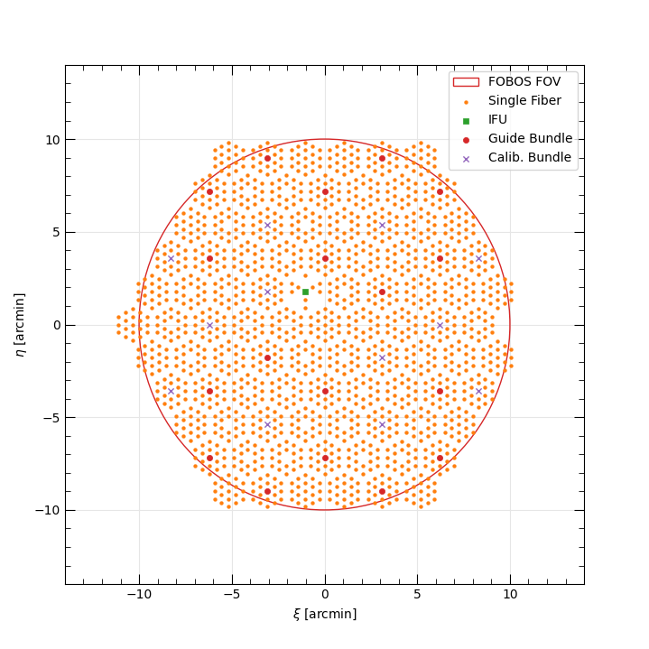
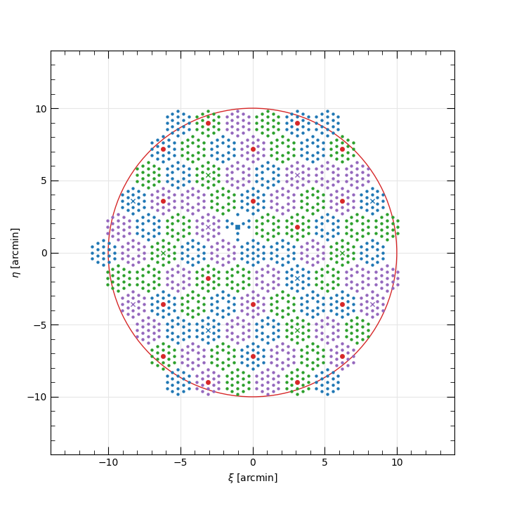
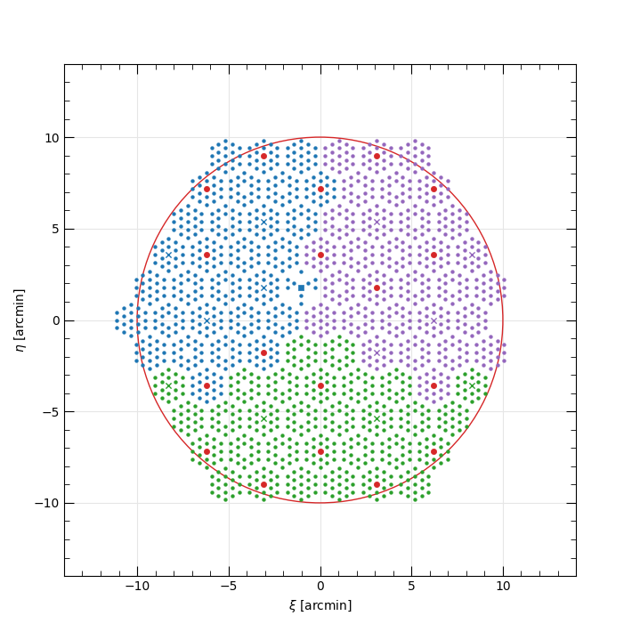

.. include:: include/links.rst

.. _layout:

FOBOS Focal-Plane Layout
========================

To show the layout of the active FOBOS apertures during a specific setting of
the spectrographs, use the ``fobos_layout`` script:

.. include:: help/fobos_layout.rst

Example
-------

If you run ``fobos_layout`` without any arguments, it will show the following plot:

   Default on-sky layout of FOBOS apertures relative to the field center.  The
   circular FOV of the Keck II Nasmyth port is large red circle.  Each marker
   represents an active Starbug in the focal plane and the marker shape and
   color represents they Starbug payload type: single-fiber apertures are orange
   dots, 37-fiber IFUs are green squares, imaging bundles used for guiding and
   focus-tracking are small red circles, and 7-fiber flux-calibration bundles
   are purple crosses.  Note the monolithic IFU is located at the right edge of
   the field of view, where there appears to be a missing Starbug module.

Spectrograph Modes
------------------

Each spectrograph can be set to one of three modes:

 #. **MOS**: Deploys mostly single-fiber apertures (cf. Spectrograph 1),
 #. **IFU**: Deploys 37-fiber IFUs and sky fibers, and
 #. **MONO**: Deploys the monolithic IFU and sky fibers.

You can use the ``fobos_layout`` script to show the apertures deployed for these
options and any combination of modes; e.g., ``--mode 1 2 1`` sets spectrographs
1 and 3 in MOS mode and spectrograph 2 in IFU mode.

The table(s) below provide the number of apertures of each type deployed in each
mode for each spectrograph.  Note that the only difference between the three
spectrographs is that Spectrograph 1 deploys one 37-fiber IFU in MOS mode.  This
to enable one IFU to always be on-sky in any mode for quick follow-up of targets
of opportunity.

.. include:: include/fobos_deployments.rst

Design options
-------------- 

The :class:`producer.deploy.FOBOSApertures` class allows for two different
spectrograph-to-module mapping design options, numbered 1 and 2.  All scripts
currently use the first option, which maps modules in a way that each
spectrograph samples regions distributed over the full field of view.  When all
spectrographs are in MOS mode, the mapping is shown below, where fibers mapped
to spectrographs 1, 2, and 3 are shown in blue, green, and purple, respectively.
(The red points are the imaging bundles which are not mapped to a spectrograph.)

Alternatively, the second option isolates modules mapped to each spectrograph to
designated regions within the field of view, as shown below.

We're currently assessing these options. 

