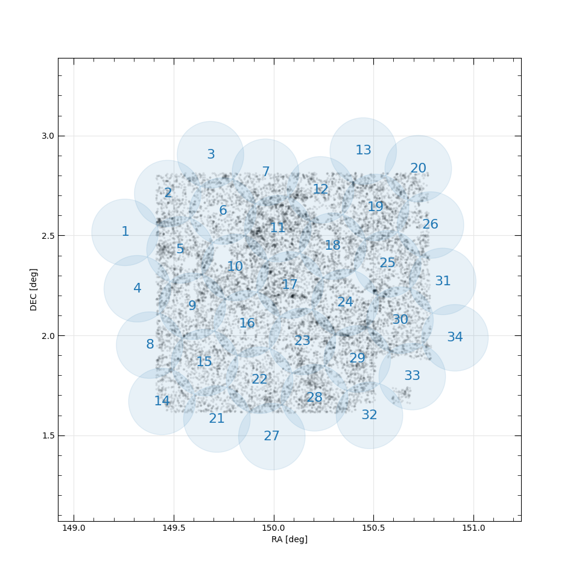
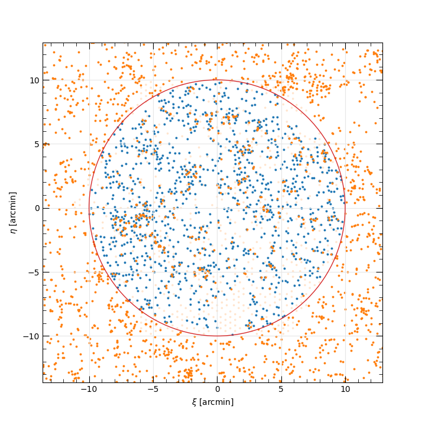
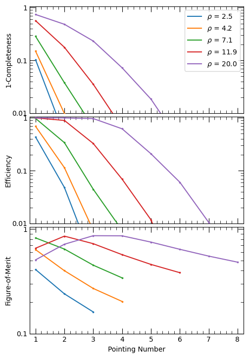

.. include:: include/links.rst

.. _makeplan:

Configure FOBOS observations
============================

Provided an ascii text file with a columnated set of targets to be observed, the
``fobos_makeplan`` script can be used to construct FOBOS configuration files,
one file per observation:

.. include:: help/fobos_makeplan.rst

For the examples shown below, we use the data provided by
``producer/data/examples/quiescent_sample.txt``, quiescent galaxies selected
from the `Laigle et al. (2016, ApJS, 224, 24)
<https://ui.adsabs.harvard.edu/abs/2016ApJS..224...24L/abstract>`__ COSMOS
catalog.  All commands below are performed in the ``producer/data/examples``
directory. 

Tiling
------

The planning script automatically tiles the provided data with a uniformly distributed
set of FOBOS pointings.  To see the tiles, run with the ``--tile_only`` option:

.. code-block:: console

    fobos_makeplan quiescent_sample.txt  -c 2 3 --tile_only

   Uniform tiling of the sources in
   ``producer/data/examples/quiescent_sample.txt``.  Sources in the catalog are
   in light gray points, FOBOS pointings are in blue and identified by a running
   index.

You can modestly alter the placement and inclusion of the tiles using the
``--offset`` and ``--min_n`` command-line options.  The above call results in 34
FOBOS tiles.

Aperture Assignment
-------------------

After constructing the tiles, the ``fobos_makeplan`` script iterates through
each tile (pointing center) and allocates FOBOS apertures to sources.  Each full
allocation results in an observation configuration file, and the default
approach is to revisit each pointing until all objects are allocated.  (However,
targets can be allocated to multiple tiles; see :ref:`knownissues`.)

For example, the call

.. code-block:: console

    fobos_makeplan quiescent_sample.txt  -c 2 3 -r ./quiescent_config/fobos_cfg

constructs configuration files with the root name ``fobos_cfg*`` and places them
in the ``./quiescent_config`` directory, producing 135 (!) configurations.

For each tile, the script provides a report, like the following (along with
listing the files that have been written):

.. code-block:: console

    ----------------------------------------------------------------------
    Allocating FOBOS apertures in tile 11.
    Total number of targets available: 1446
    Total number of pointings: 6

    Pointing Avail Alloc  Compl    Eff MeanEff
    -------- ----- ----- ------ ------ -------
           1  1630  1100 0.7607 0.6748  0.6748
           2  1630   268 0.9461 0.1644  0.4196
           3  1630    61 0.9882 0.0374  0.2922
           4  1630    13 0.9972 0.0080  0.2212
           5  1630     2 0.9986 0.0012  0.1772
           6  1630     2 1.0000 0.0012  0.1479
    ----------------------------------------------------------------------

In addition to a running index of the pointing number, the columns are:

- ``Avail``: The total number of science apertures available for allocation.
- ``Alloc``: The number of apertures allocated to targets.
- ``Compl``: The cumulative fraction of observed targets, relative to the total
  number available (see above the table).
- ``Eff``: The "efficiency" of the observation, defined as the fraction of
  allocated science apertures compared to the total.
- ``MeanEff``: The mean of the efficiency for this and all previous
  observations.

You can limit the allocation to a maximum number of revisits per tile using the
``--max_nobs`` command-line option.  For example,

.. code-block:: console

    fobos_makeplan quiescent_sample.txt  -c 2 3 -r ./quiescent_config/fobos_cfg --max_nobs 1

will produce a single allocation (and configuration file) for each tile.

Configuration Files
-------------------

FOBOS configuration files are human-readable ascii files with FOBOS
configuration and aperture assignment details for a *single* acquisition.  An
example from the call above looks like this:

.. code-block:: console

    # FOBOS configuration file
    # 
    # Generated: Wed 25 Aug 2021 09:18:11
    # 
    # ----------------------------------------------------------------------
    # 
    # [FOBOS_MODE]
    # version = 0.1
    # mode = 1,1,1
    # baseline = True
    # design = 1
    # 
    # [TARGETS]
    # source = /Users/westfall/Work/packages/fobos/producer/producer/data/examples/quiescent_sample.txt
    # ra_col = 2
    # dec_col = 3
    # id_type = index
    # allocated = 1100
    # 
    # [POINTING]
    # ra = 150.02079682
    # dec =   2.53396330
    # 
    # ----------------------------------------------------------------------
    # 
    # Columns are:
    #     MID - Module ID number
    #     SID - Spectrograph ID number
    #     BID - Starbug ID number
    #     Type - Starbug payload type: (0) single-fiber, (1) 37-fiber 
    #            IFU, (3) imaging bundle, (4) flux-calibration bundle.
    #     OBJID - Object ID 
    #     RA - Target right ascension (decimal degrees)
    #     Dec - Target declination (decimal degrees)
    # 
    # MID   SID   BID   Type   OBJID             RA           DEC
        4     1    15      0   14404   149.94378104    2.68068134  
        4     1    16      0   14316   149.95233351    2.67466332  
        4     1    17      0   14197   149.95084962    2.66581692  
        4     1    18      0   14298   149.94494197    2.67279699  
    .... 

The header (the commented section) contains configuration information, including
the spectrograph modes, the pointing center, and the original target catalog
file.  The columnated data provide the aperture assignments, with the columns
described in the header.

Configuration Plot
------------------

The configuration file can be used to construct a plot of the FOBOS
configuration using the ``fobos_showcfg`` script:

.. include:: help/fobos_showcfg.rst

For example, the calls to ``fobos_makeplan`` above create a file that can be shown as follows:

.. code-block:: console

    fobos_showcfg quiescent_config/fobos_cfg_11_1.db

This will only show the available and allocated apertures, and the positions of
the allocated targets.  To get the positions of the *unallocated* targets, the
code needs to be able to access the original target catalog, which is parsed
from the header of the configuration file.  If it can, you can include these in
the plot using the ``--full`` option:

.. code-block:: console

    fobos_showcfg quiescent_config/fobos_cfg_11_1.db --full

   Allocation result for tile 11 in the FOBOS observing plan for the quiescent
   sampled considered above.  The red circle is the FOBOS field of view.
   Allocated and unallocated targets are shown as blue and orange points,
   respectively; plotting the latter requires the ``--full`` command-line
   option.  Apertures are plotted as shaded circles, where the size of the
   circle represents the aperture collision radius (currently 10 arcsec).
   Allocated apertures are shown in blue and unallocated apertures are shown in
   orange.  Note that the unallocated aperture positions are currently their
   "home" position; however, these positions would need to be adjusted to avoid
   collisions with allocated apertures.
   

An observing plan figure-of-merit
=================================

[This should be better integrated into the docs.  I am including it here largely
so that I don't lose/forget it!]

When optimizing the use of FOBOS, we could consider the following derivation of
a figure-of-merit. 

Let N be the total number of targets to be observed for a given program, and
let's make the following assumptions:

 - all the objects are observed for the same amount of time, and
 - the "signal-to-noise" (S/N) of the observations scales as sqrt(N).

We can write the total number of observed targets as

n = sum^p_k eta_k A = p <eta> A,

where p is the number of pointings and each pointing k allocates a fraction
eta_k of the available number of apertures A (e.g., the total number of
single-fiber apertures); <eta> is the mean eta over all pointings observed so
far.  Ideal performance is when every pointing has perfect efficiency; i.e.,
eta_k = 1.  A relevant figure-of-merit can be cast as the ratio of the acquired
S/N to the required observing time relative to the ideal instrument:

E = (s / t) / (S / T) = s/S * T/t,

where S is the S/N reached by the ideal instrument in time T, and s and t are
the complementary quantities for the real instruments.  For N total program
targets, we can write s/S = sqrt(n/N) and T/t = <eta>.  Therefore,

E = sqrt(f) <eta>

where the program completeness is f = n/N.  The aggregate completeness of the
observations increases with more pointings, whereas the average allocation
efficiency decreases, such that E should exhibit a maximum.

   Simulation of allocating single-fiber FOBOS apertures to a random set of data
   with different densities (per sq. arcmin; see legend).  From top to bottome,
   the panels show the fraction of objects remaining to be observed (1 - n/N),
   the allocation efficiency of each pointing, and the above derived
   figure-of-merit, E, as a function of the number of pointings.
   

